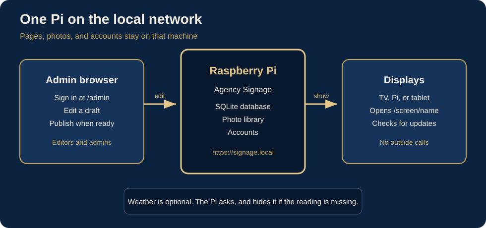
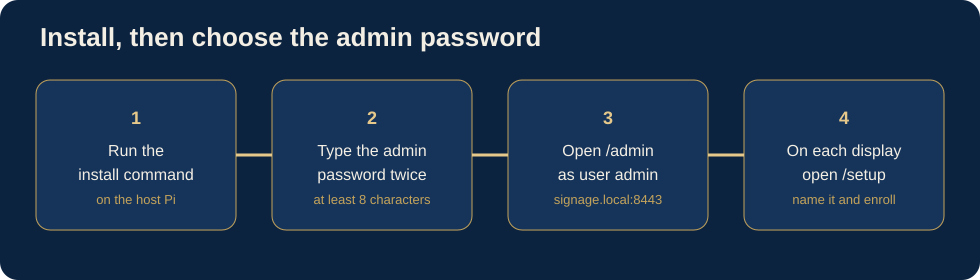
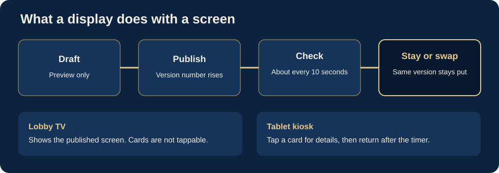

# Agency Signage

A local signage server for a Raspberry Pi on the internal network. The Pi holds the pages, photos, and accounts. Displays open a screen URL and never call the public internet themselves. Weather is the one optional outbound request, and the Pi makes it. If that request fails, the weather is left off the sign.



## Install on the Pi



On the Raspberry Pi that will host the signs, run:

```bash
curl -fsSL https://raw.githubusercontent.com/CopIXus/AgencySignage/main/deploy/install.sh | sudo bash
```

The installer downloads the app, installs Node, and starts it at boot. The first time through, it asks you to choose the `admin` password. Type it twice. It must be at least 8 characters. That password creates the account and is not saved in the service file. Later updates with the same command leave the database, photos, and password in place.

Then open `https://signage.local:8443/admin` and sign in as `admin`.

## What a screen does



## First start on a computer you already cloned

```bash
node server/index.js
```

The process listens on HTTPS port **8443** and redirects HTTP port **8080** to it. If you did not set a password during install, the first launch creates an administrator named `admin`, prints a password, and saves it in `data/initial-password.txt`.

Open `https://localhost:8443/admin`.

Trust the local certificate once so the browser stops warning: download `https://localhost:8443/setup/ca.crt` and install it as a trusted root. Kiosk installers do this for the display device.

## What you can edit

- Award boards, with history that either fits or scrolls slowly, and a control that moves the current honoree into history.
- Card directories that stay alphabetical and scale so the list stays on one screen.
- Rotating slides with text, a QR code, and optional day and time windows.
- Playlists of those screens, with a quiet countdown, a nightly-safe loop, and one priority override.
- Clock and weather on each screen. Weather hides when it cannot be refreshed.

The dashboard shows whether each named display is in use, how many times the page has loaded, whether it is on the published version, and whether the resolution matches.

On a tablet, turn on **Tap a card to open details** for that screen. A tap opens the full card, and the board returns on its own after the number of seconds you set. Touching the detail keeps it open a little longer. Lobby TVs can leave this off.

## Raspberry Pi

The install command above installs Node, Avahi (`signage.local`), and a systemd service. The app code and the `data/` directory stay separate, so an update can replace the app and leave the database and media in place. From a checkout you already have, `sudo bash deploy/install-pi.sh` does the same thing.

Then open `https://signage.local:8443/setup` on each TV. Name the device, pick the screen and the panel mode (through 4K), and install. On the Pi that hosts the site, the page can run the installer. On another Pi or Linux PC, run the `curl | bash` command the page shows. On Windows, run the PowerShell script. Android TV cannot run that script; pin a kiosk browser to the screen URL instead.

The kiosk turns off screen blanking, restarts Chromium if it exits, and restarts it again at 3:00 by default. Leave kiosk mode for maintenance with Ctrl+Alt+F2, then:

```bash
systemctl --user stop agency-signage-kiosk.service
```

## Clock, backup, passwords

A Pi without a hardware clock forgets the time when power is lost. That throws off the lobby clock and the day/time windows. Point the Pi at the building’s time server, or fit a small hardware clock. The dashboard warns when the year looks wrong. Displays still do not call out themselves.

The service keeps the last seven daily copies of the database in `data/backups/`. An administrator can also download a zip of the database and media, and restore that zip from Settings.

Reset a lost password on the Pi:

```bash
node server/reset-password.js admin 'a-new-password'
```

## Development without HTTPS

```bash
set SIGNAGE_INSECURE=1
node server/index.js
```

That serves plain HTTP on port 8080 for a local check. The Pi install uses HTTPS.
